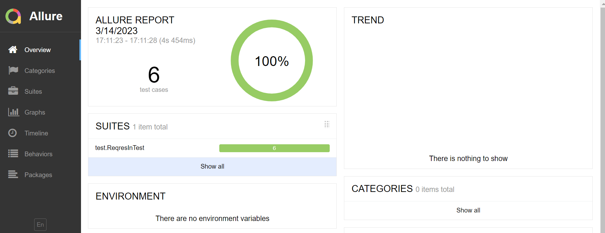
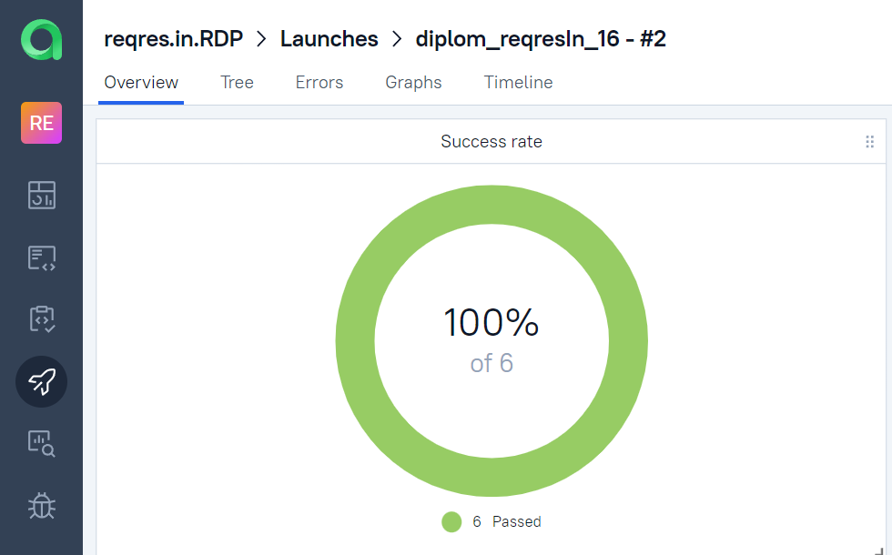
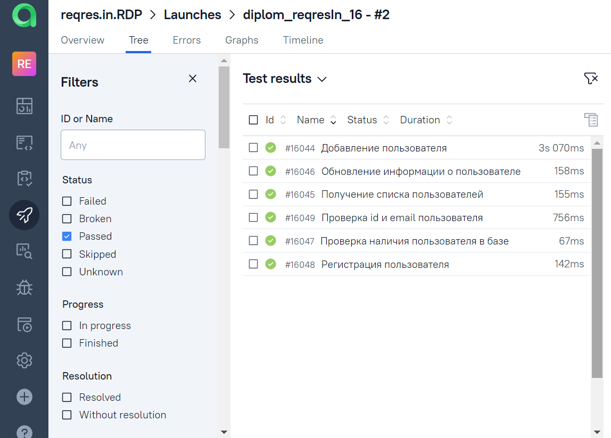
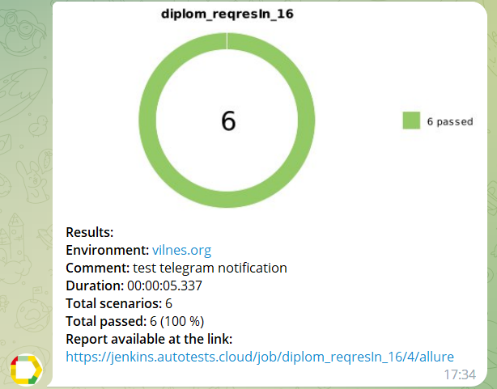

## Учебный проект по автоматизации тестирования (API)

### Веб сайт <a target="_blank" href="https://reqres.in/">Reqres.in</a>

## :pushpin: Содержание:

- Технологии и инструменты
- Список проверок, реализованных в тестах
- Запуск тестов (сборка в Jenkins)
- Allure-отчет
- Интеграция с Allure TestOps
- Интеграция с Jira
- Уведомление в Telegram о результатах прогона тестов

## :pushpin:Технологии и инструменты

## :bookmark_tabs: Список проверок, реализованных в автотестах

- [x] Получение списка пользователей
- [x] Проверка наличия пользователя в базе
- [x] Добавление пользователя
- [x] Обновление информации о пользователе
- [x] Регистрация пользователя
- [x] Проверка id и email пользователя

## :computer: Запуск тестов

###  Локальный запуск :
1. Запуск с командной строки: gradle clean test
2. Получение отчёта: gradle allureServe

###  Удаленный запуск (в Jenkins):
1. Открыть <a target="_blank" href="https://jenkins.autotests.cloud/job/diplom_reqresIn_16/">проект</a>
2. Нажать **Собрать**

## </a> Отчет в <a target="_blank" href="https://jenkins.autotests.cloud/job/diplom_reqresIn_16/2/allure/">Allure report</a>

*После выполнения сборки, в блоке <code><strong>*История сборок*</strong></code> напротив номера сборки появится
значок <code><strong>*Allure
Report*</strong></code>, кликнув по которому, откроется страница с сформированным html-отчетом.*

##  Отчет о результатах тестирования в [Allure Report](https://jenkins.autotests.cloud/job/diplom_reqresIn_16/2/allure/)

### :pushpin: Общая информация

*Главная страница Allure-отчета содержит следующие информационные блоки:*

> - [x] <code><strong>*ALLURE REPORT*</strong></code> - отображает дату и время прохождения теста, общее количество прогнанных кейсов, а также диаграмму с указанием процента и количества успешных, упавших и сломавшихся в процессе выполнения тестов
>- [x] <code><strong>*TREND*</strong></code> - отображает тренд прохождения тестов от сборки к сборке
>- [x] <code><strong>*SUITES*</strong></code> - отображает распределение результатов тестов по тестовым наборам
>- [x] <code><strong>*ENVIRONMENT*</strong></code> - отображает тестовое окружение, на котором запускались тесты (в данном случае информация не задана)
>- [x] <code><strong>*CATEGORIES*</strong></code> - отображает распределение неуспешно прошедших тестов по видам дефектов
>- [x] <code><strong>*FEATURES BY STORIES*</strong></code> - отображает распределение тестов по функционалу, который они проверяют
>- [x] <code><strong>*EXECUTORS*</strong></code> - отображает исполнителя текущей сборки (ссылка на сборку в Jenkins)

  

##  Интеграция с [Allure TestOps](https://allure.autotests.cloud/launch/20502)

### :pushpin: Основной дашборд

  

### :pushpin: Тест-кейсы

  

##  Уведомления в Telegram с использованием бота

> После завершения сборки специальный бот, созданный в <code>Telegram</code>, автоматически обрабатывает и отправляет сообщение с отчетом о прогоне тестов.

